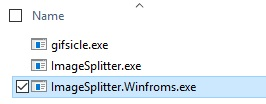
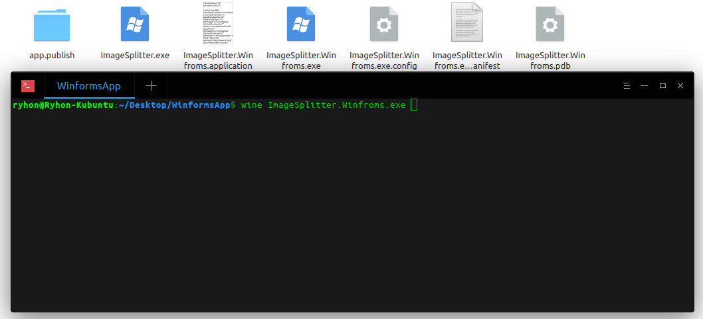
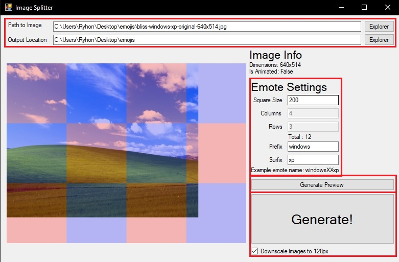
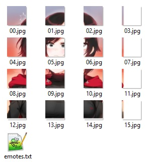

# ImageSplitter
Image splitter is a program which allows you to split images into squares, originally created as a command for a Discord Bot

## Download
ImageSplitter is available for Windows and Linux/MacOS by using [Wine](https://wiki.winehq.org/Download) or [Mono](https://www.mono-project.com/download/stable/)
### [Download Page](https://github.com/Ryhon0/ImageSplitter/releases)

# How to use
* Run `ImageSplitter.Winforms.exe`

    * Windows:

    
    * Linux/MacOS: Open your console in the `WinformsApp` folder and run `wine ImageSplitter.Winforms.exe` or `mono ImageSplitter.Winforms.exe`
    
    

* Generate your images
    
    * Enter the path for the image and output loaction
    * Set the square size and the prefix or surfix
    * Generate preview to preview how the emotes will look
    * Generate your emotes, optionally you can disable downscaling (128px is the max emote size on Discord)

* Add the emotes to your Discord server, you can use `emotes.txt` to paste them quickly into chat

    
    

# To do
* Add support for animated images
* Use a rendering engine with hardware acceleration support
* Automatically adjust the square size based on the column or row count